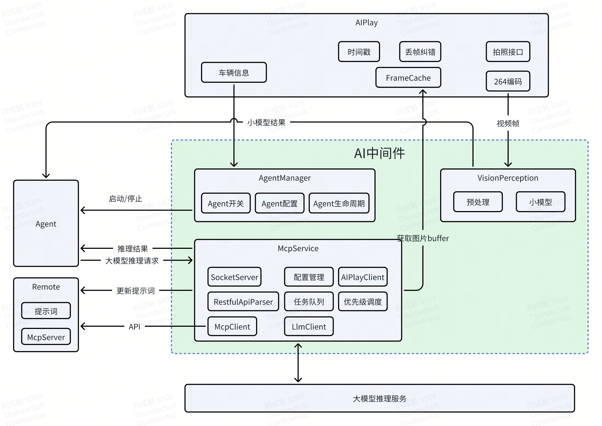
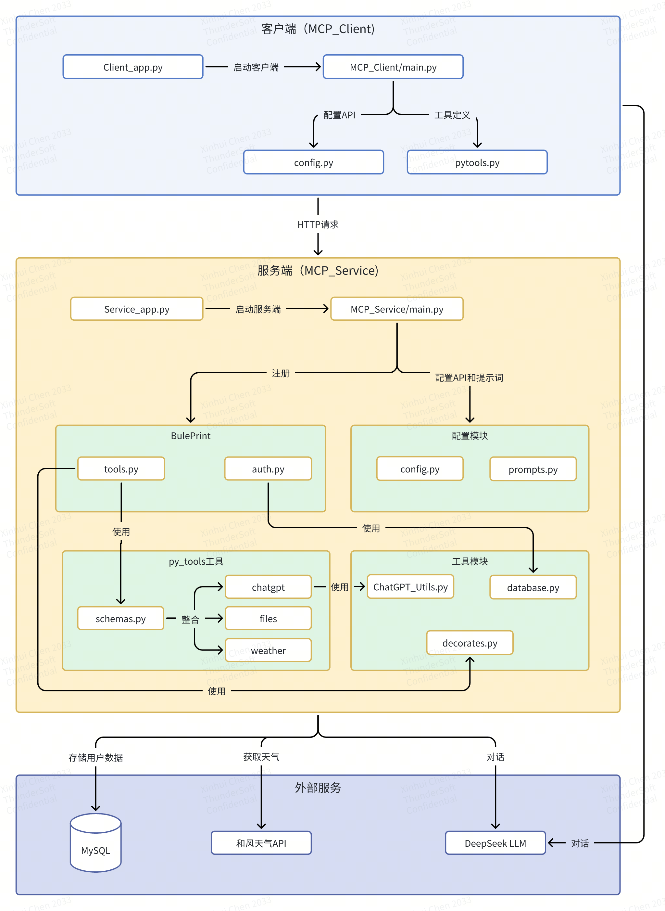

# MCP
实现一个简单的MCP服务系统以及一个简单的客户端示例

### 项目介绍

### 项目架构图

## 架构说明

### 1. 客户端 (MCP_Client)
- **Client_app.py**: 客户端入口文件
- **main.py**: 主要实现类ChatGptTool，处理用户登录、工具调用等
- **config.py**: 配置文件，存储API密钥等
- **pytools.py**: 定义本地工具

### 2. 服务端 (MCP_Service)
- **Service_app.py**: 服务端入口文件
- **main.py**: Flask应用主文件

#### 2.1 蓝图模块 (Blueprints)
- **auth.py**: 处理用户认证
- **tools.py**: 处理工具调用

#### 2.2 工具模块 (Utils)
- **decorates.py**: 装饰器工具
- **database.py**: 数据库操作
- **ChatGPT_Utils.py**: ChatGPT工具类

#### 2.3 Python工具 (PyTools)
- **schemas.py**: 工具schema定义
- **weather_tools.py**: 天气相关工具
- **file_tools.py**: 文件操作工具
- **chatgpt_tools.py**: ChatGPT相关工具

#### 2.4 配置模块 (Config)
- **config.py**: 配置信息
- **prompts.py**: 提示词模板

### 3. 外部服务
- **MySQL数据库**: 存储用户信息和聊天历史
- **天气API**: 提供天气查询服务
- **DeepSeek LLM**: 大语言模型服务

## 主要功能流程

1. **用户认证流程**:
   - 用户通过客户端登录/注册
   - 服务端验证用户信息
   - 使用session维护登录状态

2. **工具调用流程**:
   - 客户端发送请求到服务端
   - 服务端验证session
   - 调用相应的工具处理请求
   - 返回结果给客户端

3. **聊天对话流程**:
   - 用户输入传递给DeepSeek模型
   - 模型根据需要调用工具
   - 返回处理结果给用户

## 安全特性

1. 用户认证和会话管理
2. API密钥保护
3. 数据库访问控制
4. 登录状态检查装饰器

## 扩展性

1. 工具可以通过schemas.py轻松添加
2. 支持多种外部服务集成
3. 模块化设计便于维护和扩展
### 1.环境配置

#### 1.1 代码环境配置